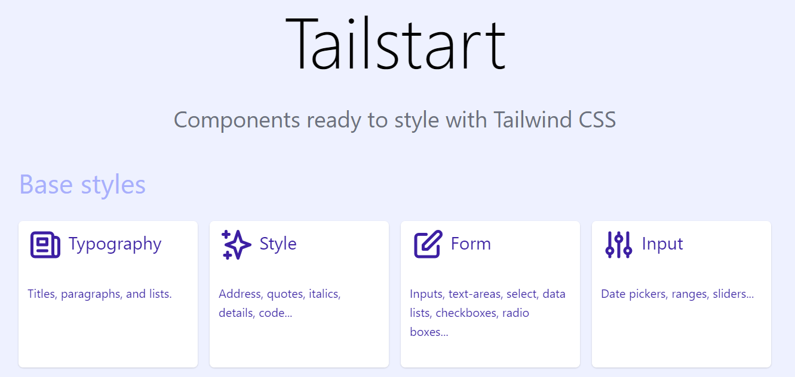
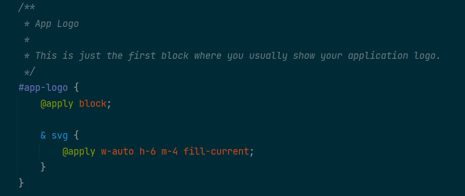

# Tailstart

HTML Components ready to style with Tailwind CSS

## What is this for?

If you need to create a visual style for your site, you can start with the basics elements and components as an "HTML skeleton". It incorporates a lot of examples, from simple paragraphs and code blocks, to common componentes like cards, table and pagination.

This is useful when you need a visual guidelines to implement from the very base, while leaving space to extend with new components.

## Installation

Simple clone this repository with `git`, and call your Node.js package manager of choice, like `npm`.

    git clone https://github.com/DarkGhostHunter/Tailstart.git my-new-project
    rm my-new-project/.git
    cd my-new-project
    npm install

If you don't have Node.js, [this is a good opportunity to install it](https://nodejs.org/).

> If you're using Windows, install [Git](https://gitforwindows.org/) or [Github Desktop](https://desktop.github.com/).

## Usage

Tailstart is basically a [Laravel Mix](https://github.com/JeffreyWay/laravel-mix)-powered server that serves static HTML files, parses PostCSS and, as you are guessing now, includes the Tailwind CSS framework. It's meant to be used with [Component Extraction](https://tailwindcss.com/docs/extracting-components).

To start developing, just call `npm mix watch`:

    $> npm mix watch
    
        Laravel Mix v6.0
        ┌─────────────────────────────────────┬───────────┐
        │                                File │ Size      │
        ├─────────────────────────────────────┼───────────┤
        │                    public/js/app.js │ 188 bytes │
        │    public/tailstart/js/tailstart.js │ 6.92 KiB  │
        │                  public/css/app.css │ 64.7 KiB  │
        │  public/tailstart/css/tailstart.css │ 16.9 KiB  │
        └─────────────────────────────────────┴───────────┘

This will run a [local BrowserSync server](http://localhost:3000/), with all the HTML pieces to style and their
description. You can even check and sync the result across multiple devices!



Simply head to the `resources/css` directory and start editing each file. Almost all stylesheets have some minor
guidelines you can follow along.



> To further configure Laravel Mix, [refer to the official documentation](https://laravel-mix.com/).

## Component Extraction vs HTML CSS Classes

> TL;DR: If you need the smallest CSS output for production, Component Extraction won't be your friend.

The advantage of using vanilla Tailwind CSS over HTML is a very small CSS final build, as it will purge unused CSS from
the framework itself by reading files like PHP, HTML or JS. With the JIT engine, wasting hours configuring the variants
needed (like `hover:focus:md` and so on) it's unnecessary.

That being said, if you're creating a Javascript app around components, Component Extraction won't be as useful.

| Component Extraction | HTML CSS Classes
|---|---|
| `<div class="accordeon">` | `<div class="border rounded shadow...">` |
| Requires Bundler | Works with Bundler or from a CDN |
| Simplifies multiple classes into one | Requires repeating the classes, over and over again |
| Final output takes may take a dozen of KB | PurgeCSS and CSSnano outputs generate very small builds |
| Good for Server-Side rendering | Good for Client-Side rendering (Javascript)

As a comparison, **Bootstrap 5 generates a minified 150~ KB stylesheet**.

## Out-of-the-box experience

This package includes:

- Autoprefixing
- PostCSS Preset Environment
- PostCSS Nesting
- PostCSS Imports
- Live updates on styles.

This will allow you to do things like this, and see changes automatically in the browser.

```postcss
@import "custom/style.css";

@layer components {
    .profile {
        @apply border-2 w-full text-yellow-800;

        & > .img {
            @apply rounded-t;
        }
    }
}
```

If you need more PostCSS plugins, just head out to this [PostCSS section](https://www.postcss.parts/).

## Javascript components

Instead of reinventing the wheel, Tailstart uses [Bootstrap 5's ESM-enabled Javascript](https://getbootstrap.com/docs/5.0/getting-started/javascript/#using-bootstrap-as-a-module):

- You get all Bootstrap 5 well-thought behaviour.
- It makes your frontend compatible if you're switching from Bootstrap.
- It's compatible with Vue, React, Angular and what else.

You can check how Tailstart enables everything at once in the [`app.js`](resources/js/app.js) file. All of these components are styled in [`resources/css/javascript/`](resources/css/javascript).

In the meantime, see this example of using a modal with Bootstrap with Vue 3:

```vue
<template>
  <button type="button" class="btn btn-blue" @click="modal.show()">
    Launch demo modal
  </button>
  <div class="modal fade" ref="bootstrapModal" tabindex="-1" aria-hidden="true">
    <!-- ... -->
  </div>
</template>

<script>
import { Modal } from 'bootstrap'

export default {
    data: () => ({
        modal: null
    }),
    mounted() {
        this.modal = new Modal(this.$refs.bootstrapModal)
    }
};
</script>
```

## Building

Call `mix production`, and you should see the final output in your `public/css` and `public/js` folders.

If you're developing a [Laravel application](https://laravel.com/), you may want to just copy-paste the `resources/`
directory into your project, and install the [dev-dependencies](package.json) of this package.

## License

This package is open-sourced software licensed under the [MIT license](LICENSE).